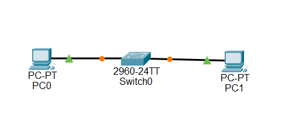

# Day 1 — Switch + 2 PCs

> **Course:** Cisco Packet Tracer Learning Course  
> **Day:** 1 of 90  
> **Topic:** Introduction to Networking — Switch + 2 PCs  
> **Device Used:** Cisco 2960-24TT Switch  
> **Status:** ✅ Completed

---

## 🎯 Objective

Learn the basics of networking by building a simple network with two PCs and one Cisco 2960-24TT switch, then verify communication between them.

---

## 📚 What I Learned Today

### 1. IP Address

An IP Address is a unique number assigned to every device on a network — like a home address for your computer.

- Example: `192.168.1.1`
- Every device must have a unique IP
- Format: four numbers (0–255) separated by dots
- Two types:
  - Private IP — used inside homes and offices (`192.168.x.x`, `10.x.x.x`)
  - Public IP — used on the internet, provided by the ISP

---

### 2. Subnet Mask

A Subnet Mask tells a device which other devices are in the same network (neighbors) and which are remote (need a router).

- Example: `255.255.255.0`
- Same subnet → devices communicate directly
- Different subnet → a router is required

**Simple analogy:**
- IP address = your house number
- Subnet mask = your street name

---

### 3. Switch

A Switch is a device that connects multiple devices within the same network.

- Forwards data between connected devices
- Does not assign IP addresses — it only passes traffic
- Works only inside one network
- To connect different networks, a router is required

**Real-world examples:**
- A home WiFi router includes a built-in switch
- Offices use switches to connect many computers
- School computer labs use switches

---

### 4. Network Cables

Cables carry data between devices. Two main types are used:

| Cable Type | Used Between |
|------------|--------------|
| Straight-through | PC → Switch, Switch → Router |
| Crossover | PC → PC, Switch → Switch |

**Simple rule:**
- Different devices → straight-through cable
- Same devices → crossover cable

---

### 5. Ping

Ping is a test used to check whether two devices can communicate.

- Sends a small message and waits for a reply
- Reply received → connection works ✅
- No reply → something is wrong ❌

**Command example:**
ping 192.168.1.2 

**Possible results:**
- Reply from… → success
- Request timed out → failure
- Destination host unreachable → cannot reach the device

---

## 🛠️ Devices Used

| Device | Model | Quantity |
|--------|-------|----------|
| PC | PC-PT | 2 |
| Switch | Cisco 2960-24TT | 1 |
| Cable | Straight-through | 2 |

## 🗺️ Topology

*Figure 1: Day 1 Network — 2 PCs connected via Cisco 2960-24TT switch*

---

---

## 📋 IP Addressing

| Device | IP Address | Subnet Mask |
|--------|------------|-------------|
| PC0 | 192.168.1.1 | 255.255.255.0 |
| PC1 | 192.168.1.2 | 255.255.255.0 |

You can change ip and subnet
---

## ⚙️ Steps Performed

1. Opened Cisco Packet Tracer
2. Added one Cisco 2960-24TT switch
3. Added two PCs
4. Connected PC0 to switch port Fa0/1 using a straight-through cable
5. Connected PC1 to switch port Fa0/2 using a straight-through cable
6. Assigned IP addresses to both PCs
7. Assigned the same subnet mask to both PCs
8. Tested connectivity using ping from PC0 to PC1
9. Confirmed successful communication

---

## 🧪 Verification

**Ping Test:**
Pinging 192.168.1.2 with 32 bytes of data:

Reply from 192.168.1.2: bytes=32 time<1ms TTL=128
Reply from 192.168.1.2: bytes=32 time<1ms TTL=128
Reply from 192.168.1.2: bytes=32 time<1ms TTL=128
Reply from 192.168.1.2: bytes=32 time<1ms TTL=128

Ping statistics for 192.168.1.2:
Packets: Sent = 4, Received = 4, Lost = 0 (0% loss)

✅ Communication successful.

---

## 🧠 Key Takeaway

> Same network = ping works directly.  
> Different network = a router is required.

This is the most fundamental concept in networking.

---

## 🌍 Real-World Connection

Everything practiced today reflects how real networks work:

| Real-World Scenario | Same Concept |
|---------------------|--------------|
| Home WiFi | Router contains a built-in switch |
| Office network | Many PCs connected to switches |
| School computer lab | Devices connected within one network |
| Café WiFi | All customers share one network |

---

## 📁 Folder Contents

- `README.md` — this lesson file
- `day1.pkt` — Packet Tracer project file
- `screenshots/` — topology 

---

## ✅ Status

**Day 1: Completed ✅**

**Next:** Day 2 — Router Basics 🚀
