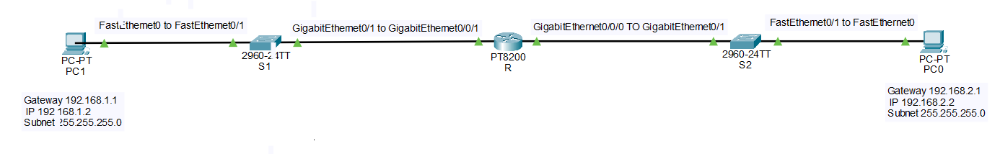

# Day 2 — Router Basics

> **Course:** Cisco Packet Tracer Learning Course  
> **Day:** 2 of 90  
> **Topic:** Router Basics — Connecting Two Different Networks  
> **Status:** ✅ Completed

---

## 🎯 Objective

Learn how a router connects two different networks and enables communication between devices that are not on the same subnet.

---

## 🛠️ Devices Used

### Hardware

| # | Device | Model | Quantity | Purpose |
|---|--------|-------|----------|---------|
| 1 | Router | Cisco PT8200 | 1 | Connects the two networks |
| 2 | Switch | Cisco 2960-24TT | 2 | Connects PCs to the router |
| 3 | PC | PC-PT | 2 | End devices (clients) |
| 4 | Cable | Copper Straight-Through | 4 | Wired connections |

### Ports Used

| Device | Port | Connects To |
|--------|------|-------------|
| PC1 | FastEthernet0 | Switch1 FastEthernet0/1 |
| Switch1 | GigabitEthernet0/1 | Router0 GigabitEthernet0/0/1 |
| Router0 | GigabitEthernet0/0/1 | Switch1 (left side — PC1's network) |
| Router0 | GigabitEthernet0/0/0 | Switch2 (right side — PC0's network) |
| Switch2 | GigabitEthernet0/1 | Router0 GigabitEthernet0/0/0 |
| Switch2 | FastEthernet0/1 | PC0 FastEthernet0 |
| PC0 | FastEthernet0 | Switch2 FastEthernet0/1 |

---

## 📚 What I Learned Today

### 1. Router

A Router is a device that connects two or more different networks.

- Finds the best path for data between networks
- Acts as the default gateway for connected PCs
- Works at Layer 3 (Network Layer)
- Switches connect devices — routers connect networks

**Simple analogy:**
- Switch = a street (same network)
- Router = a bridge (connects two streets)

---

### 2. Router Interface

A Router Interface is a physical port on the router where cables connect.

- Each interface belongs to a different network
- Needs an IP address and subnet mask
- Must be enabled with `no shutdown`

**Common interfaces on PT8200:**
- GigabitEthernet0/0/0 (G0/0/0)
- GigabitEthernet0/0/1 (G0/0/1)

---

### 3. Default Gateway

The Default Gateway is the IP address of the router that a PC uses to reach other networks.

- Without a gateway, a PC can only talk to its own network
- With a gateway, the PC can reach other networks
- Must be on the same subnet as the PC

**Simple analogy:**
- IP address = your house address
- Subnet mask = your street name
- Default Gateway = the highway on-ramp to leave your city

---

### 4. no shutdown

By default, router interfaces are OFF.

- Use `no shutdown` to turn a port ON
- Without this, the port stays down
- This is one of the most common beginner mistakes

---

### 5. TTL (Time To Live)

TTL is a number in each packet that decreases by 1 per router.

- Starts at 128 (Windows default)
- Decreases by 1 per hop
- Helps prevent infinite loops

**How to read TTL:**

| TTL Value | Meaning |
|-----------|---------|
| 128 | Same network (no router) |
| 127 | Passed through **1 router** |
| 126 | Passed through **2 routers** |

**Example:** If TTL = 127, the packet passed through 1 router.

---

### 6. ARP (Address Resolution Protocol) — Why the First Ping Failed

When you ping a device for the first time, you may see one packet lost.
**This is completely normal.**

**Why?**

- The PC knows the other device's **IP address**
- But it does NOT know the other device's **MAC address**
- To find it, the PC sends an **ARP Request** (broadcast): "Who has this IP?"
- The **first ping packet is dropped** during this ARP process
- Once ARP is resolved, subsequent pings succeed

**What you see:**

| Ping Attempt | Result | Reason |
|--------------|--------|--------|
| 1st ping | ❌ 1 packet lost (25% loss) | ARP resolving MAC |
| 2nd ping | ✅ 0% loss | MAC already known |

**Key takeaway:** ARP is the reason for the first packet loss. It's not an error.

---

## 🗺️ Topology

### Layout

```
[PC1] ── [Switch1] ── [Router0 G0/0/1]     [Router0 G0/0/0] ── [Switch2] ── [PC0]
192.168.1.2                                                    192.168.2.2
Gateway: 192.168.1.1                                           Gateway: 192.168.2.1
```

---

## 📋 IP Addressing

| Device | IP Address | Subnet Mask | Gateway |
|--------|------------|-------------|---------|
| PC1 | 192.168.1.2 | 255.255.255.0 | 192.168.1.1 |
| Router G0/0/1 | 192.168.1.1 | 255.255.255.0 | — |
| Router G0/0/0 | 192.168.2.1 | 255.255.255.0 | — |
| PC0 | 192.168.2.2 | 255.255.255.0 | 192.168.2.1 |

---

## ⚙️ Router Configuration

```cisco
enable
configure terminal
hostname R1

interface gigabitEthernet 0/0/0
 ip address 192.168.2.1 255.255.255.0
 no shutdown
 exit

interface gigabitEthernet 0/0/1
 ip address 192.168.1.1 255.255.255.0
 no shutdown
 exit

end
write memory
```

---

## 🧪 Verification

### Router Interface Status

```cisco
show ip interface brief
```

```
Interface              IP-Address      OK? Status     Protocol
GigabitEthernet0/0/0   192.168.2.1     YES up         up
GigabitEthernet0/0/1   192.168.1.1     YES up         up
```

Both interfaces show `up / up` ✅

---

### Ping From PC0 to PC1 (Different Networks)

```
Pinging 192.168.1.2 with 32 bytes of data:

Request timed out.                              ← ARP resolving
Reply from 192.168.1.2: bytes=32 time<1ms TTL=127
Reply from 192.168.1.2: bytes=32 time<1ms TTL=127
Reply from 192.168.1.2: bytes=32 time<1ms TTL=127

Packets: Sent = 4, Received = 3, Lost = 1 (25% loss)
```

**Second ping — ARP resolved:**

```
Pinging 192.168.1.2 with 32 bytes of data:

Reply from 192.168.1.2: bytes=32 time<1ms TTL=127
Reply from 192.168.1.2: bytes=32 time<1ms TTL=127
Reply from 192.168.1.2: bytes=32 time<1ms TTL=127
Reply from 192.168.1.2: bytes=32 time<1ms TTL=127

Packets: Sent = 4, Received = 4, Lost = 0 (0% loss) ✅
```

✅ **TTL = 127 proves the packet passed through 1 router.**

---

## 🧠 Key Takeaways

> **Same network = ping works directly.**
> **Different network = router + default gateway are required.**

> **First ping loss is normal — it's ARP resolving MAC addresses.**

> **TTL decreasing by 1 proves the router is forwarding packets.**

---

## 🌍 Real-World Connection

| Real-World Scenario | Same Concept |
|---------------------|--------------|
| Home router | Connects home network to internet |
| Office network | Router links different departments |
| ISP backbone | Routers link cities and countries |
| Internet | Millions of routers forwarding packets |

---

## 🚨 Troubleshooting Notes

| Problem | Cause | Fix |
|---------|-------|-----|
| Ping to gateway fails | Router port not configured | Assign IP + `no shutdown` |
| Ping to other PC fails | Gateway missing on PC | Add default gateway |
| Port shows `unassigned` | IP not assigned | Enter `ip address ...` |
| Port shows `down` | Cable or shutdown | Check cable + `no shutdown` |
| Both ports up but ping fails | IPs on wrong ports | Match IP to cable side |
| First ping fails | ARP resolving | Normal — retry |

---

## ✅ Status

**Day 2: Completed ✅**

**Next:** Day 3 — DHCP Server 🚀
